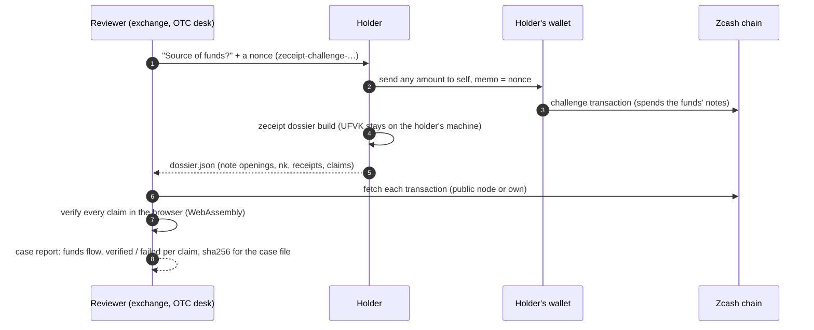
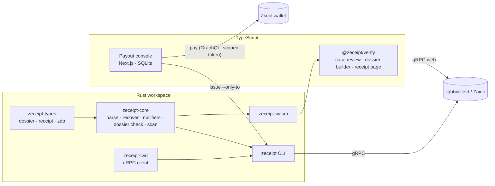

<p align="center">
  
</p>

<h1 align="center">zeceipt</h1>

<p align="center">
  <strong>Source-of-funds evidence for shielded Zcash.</strong><br>
  Prove where your shielded ZEC came from, what you paid, and that you control it now, to an exchange, an OTC desk or a lender, without handing over your viewing key.
</p>

<p align="center">
  <a href="https://beautifulremi.dpdns.org/zeceipt/case/">Review a dossier</a> &middot;
  <a href="https://beautifulremi.dpdns.org/zeceipt/build/">Build a dossier</a> &middot;
  <a href="#how-it-works">How it works</a> &middot;
  <a href="#for-judges">For judges</a> &middot;
  <a href="spec/dossier-v1.md">Spec</a> &middot;
  <a href="docs/PROOF.md">Proof</a>
</p>

<p align="center">
  <a href="https://github.com/beautifulrem/zeceipt/actions/workflows/ci.yml"></a>
  <a href="LICENSE"></a>
  
  
  
  
  
</p>

---

> [!NOTE]
> Built for **Colosseum's Crypto World's Fair 2026** (Zcash track) by one developer, [@beautifulrem](https://github.com/beautifulrem). The repository started on 2026-09-21 PT, during the event. See [For judges](#for-judges) for the live sample and where each claim's evidence is.

<p align="center">
  <strong>Try it live:</strong> <a href="https://beautifulremi.dpdns.org/zeceipt/case/#sample">a real testnet dossier, checked claim by claim in your browser</a> &middot; <a href="https://beautifulremi.dpdns.org/zeceipt/build/">build one from your own viewing key (it never leaves the page)</a>
</p>

<p align="center">
  <picture>
    <source media="(prefers-color-scheme: dark)" srcset="docs/assets/case-review-dark.png">
    
  </picture><br>
  <sub>The case review page on the real testnet sample: every claim checked in the browser (WebAssembly) against a public node. Shot by <code>packages/verify/test/shots/case-review.mjs</code>.</sub>
</p>

## The problem

Shielded ZEC is private by design, and that is exactly what compliance desks cannot work with. When a holder deposits at an exchange, cashes out through a bridge, or sells to an OTC desk, the reviewer asks where the funds came from:
- **Kraken** asked holders to confirm "the specific source of each recent Zcash deposit", its "economic purpose", and that every external wallet is "solely owned and controlled by you" ([Zcash forum, 2026-04-14](https://forum.zcashcommunity.com/t/55347)).
- **Binance** refused deposits from shielded addresses because it could not "determine the origin of these funds", returned them after 32 working days, and now takes deposits only at TEX addresses, which accept transparent funds only ([forum, 2024-05](https://forum.zcashcommunity.com/t/47667/8); [ZIP 320](https://zips.z.cash/zip-0320)).
- **NEAR Intents** has held one holder's $589k for more than 67 days. He answers with screenshots and hashes, because there is nothing better to send ([forum, 2026-09](https://forum.zcashcommunity.com/t/57497)).

Today there are two answers, and both give up the privacy the holder chose Zcash for. One is to **deshield** before depositing, which makes everything after it public. The other is to **hand over the viewing key**, which opens every past and future payment of the wallet. Proving control of a shielded address is on the community's wishlist ([ZecDev](https://zecdev.github.io/community)), and Ironwood has no signing standard for it.

## What zeceipt does

The holder builds a **dossier**: claims about specific funds, each checkable against the chain. The reviewer opens it in a browser, and every claim is verified there against public nodes, or against the reviewer's own. There is no account, and nothing is uploaded. The dossier is the only thing shared, and each claim discloses only what it needs.

| Claim | What the reviewer learns | Checked by |
|---|---|---|
| **Origin** | These funds reached the holder in this transaction, and how it was funded: the transparent addresses that signed its inputs (an exchange's hot wallet, say), or a shielded sender | Opening the note ([`zdp:1:`](spec/receipt-v0.md#11-delivery-proofs-zdp1-accepted-alongside-receipts)) and reading the transaction's inputs |
| **Path** | The funds moved on: this note was spent in the transaction that created that one | The note's nullifier, derived from the holder's nullifier key, found among the transaction's spends |
| **Deposit** | The holder made this payment (recipient, amount, memo) from these notes | A sender receipt (the output's OCK) plus the spent notes' nullifiers |
| **Control** | The holder can **spend** these funds now, after the reviewer's challenge | A transaction that spends the disclosed notes and pays the holder a note whose memo carries the reviewer's nonce. A viewing key cannot make it |

A dossier discloses note openings (transaction, amount, address, memo) and the **nullifier key `nk`**, which derives nullifiers and nothing else. It does not disclose the viewing key: the reviewer cannot decrypt any other payment, past or future. What it does not prove is listed in every report: who the counterparties are, the value of undisclosed inputs, balances beyond the notes shown, and it is not a legal attestation ([`spec/dossier-v1.md`](spec/dossier-v1.md)).

## How it works



**A real one:** the [testnet sample](https://beautifulremi.dpdns.org/zeceipt/case/#sample) explains 1 TAZ from a faucet ([`fixtures/dossier/testnet-dossier.json`](fixtures/dossier/testnet-dossier.json)):
- the origin;
- four hops;
- three payments (0.01, 0.02 and 0.03 TAZ);
- a control challenge answered on chain at height 4,421,345.

All 12 claims verify live and offline ([`docs/PROOF.md`](docs/PROOF.md) §8), and the forgeries we tried fail at the claim they attack: a wrong `nk`, a wrong nonce, a foreign note, a deposit not funded by the listed notes ([`crates/zeceipt-core/tests/dossier.rs`](crates/zeceipt-core/tests/dossier.rs)).

## Quick start

You need Rust (`protoc` is optional), Node 24+ and Python 3.

**As a reviewer.** Check the sample dossier offline, from the committed transactions, then live from a public node:

```bash
cargo build --release && Z=target/release/zeceipt
$Z dossier verify fixtures/dossier/testnet-dossier.json --raw-tx-dir fixtures/testnet   # exit 0: all 12 claims verified
$Z dossier verify fixtures/dossier/testnet-dossier.json                                  # the same, fetched from testnet.zec.rocks
$Z dossier nonce                                                                          # a challenge to send a holder
$Z dossier serve --listen 127.0.0.1:8787                                                  # the same checks over HTTP, for a back office
# POST /v1/dossiers/verify?expect_nonce=…  (the dossier as the body) → the report · POST /v1/nonces · GET /healthz
```

**As a holder.** Find your transactions and build a dossier. The UFVK is read from a file and never leaves your machine:

```bash
$Z dossier scan  --ufvk-file my.ufvk --from <birthday height>                     # every transaction that paid or spent your notes
$Z dossier build --ufvk-file my.ufvk --scan-from <height> \
                 --control-txid <your challenge tx> --nonce <the reviewer's nonce> > dossier.json
```

In the browser, the same checks run in WebAssembly: [`https://beautifulremi.dpdns.org/zeceipt/case/`](https://beautifulremi.dpdns.org/zeceipt/case/) for reviewers, [`https://beautifulremi.dpdns.org/zeceipt/build/`](https://beautifulremi.dpdns.org/zeceipt/build/) for holders, or locally with `(cd packages/verify && npm run demo)`. From JavaScript: `checkDossier(text)` and `buildDossier({ ufvk, txids, control })` in [`@zeceipt/verify`](packages/verify).

## Who pays

- **Holders: free.** The builder is open source and runs locally; the wedge is the frozen or held deposit, when a holder needs an answer the reviewer can check.
- **Reviewers: paid.** Exchanges, OTC desks, bridges, lenders. Checking in the web page is free. Paid tiers cover the verification API for compliance back offices, case exports and the reviewer's own node endpoint. The reason to pay is the cost of EDD: Binance called it "burdensome and costly", and a dossier replaces screenshots with evidence that checks itself.
- **Why now:** the EU's AMLR applies from 2027-07-10, and its Article 79 takes anonymity-enhancing coins out of regulated venues. Zcash's case to stay reachable is selective disclosure, and the EDD workflow is where it has to work.

## The building blocks

The dossier is built from primitives that also stand alone:
- **Sender receipts** (`zeceipt-v0`, [`spec/receipt-v0.md`](spec/receipt-v0.md)): one output disclosed by its OCK, optionally signed by an issuer key that its domain confirms.
- **Delivery proofs** (`zdp:1:`, the format of [zcash-delivery-proof](https://github.com/saplingcash/zcash-delivery-proof)): one note opened by the recipient or the sender, made with `zeceipt prove-delivery` and checked by the same verifier.
- **A payout console** (`apps/console`) for treasurers who pay in shielded ZEC and issue a receipt per payment.

Their live pages:

<p align="center">
  <strong>Try it live:</strong> <a href="https://beautifulremi.dpdns.org/zeceipt/r#eyJ2ZXJzaW9uIjoiemVjZWlwdC12MCIsIm5ldHdvcmsiOiJ0ZXN0IiwicG9vbCI6Imlyb253b29kIiwidHhpZCI6ImZjZmRlNjI1Njg1YjQzZDdhYjE3Njk3MDhmNWE2NmQ3YThmZTg4YWJiZmM2ZTE0OTk4NGYzYzBhZGE2ODdmMGIiLCJvdXRwdXRfaW5kZXgiOjIsIm9jayI6IlJQdWhlNjBCcm5IUnJSVFFlNGZkR2E1bzF6N0dhQzQ1ajA2RGVTdWhQM0EiLCJsYWJlbCI6IklOVi1ULTAwMSIsImlzc3Vlcl9rZXlfaWQiOiJ0ZXN0bmV0LTIwMjYtMDlAYmVhdXRpZnVscmVtaS5kcGRucy5vcmciLCJpc3N1ZXJfcHVia2V5IjoiY2QzNGY1NTM1YzEzOTg1ODA0MjlmODJiNGQyMzQ0ZTU1MzEzMjE0OGM4ZTY3Mzc2YjU2Nzg5MDFmODRhM2Y2ZSIsInNpZ25hdHVyZSI6ImUzMzJkN2ZhODYyMWMzODI0NmEzMzQ3ZWMwMjQ5ZTIyZjgzOWM2ZDcxMmVjYjg1MjYzYzlmOWUyYTI3MjYyYzM3NDYyOGY5YjgyMWZmZjA5ZWFjY2FiYzFjMDQyZjhmMjc3NjAwMTM1NDZhOWNhMTFjODYyZWI0OTMxZWIyYzAxIiwiemlwMzExX3Byb2ZpbGUiOiJvdXRwdXRzLW9ubHkifQ">a signed testnet receipt whose issuer your browser can confirm</a> &middot; <a href="https://beautifulremi.dpdns.org/zeceipt/r#zdp:1:C39o2go8T5hJ4ca_q4j-qNdmWo9waRer10NbaCXm_fwCAgDmVmwDIVqG3vVI37czhBnuIBkcKPKQ7Qvz6NpGILnkJpgEwGeJ8I0vrQgGQEIPAAAAAADJ4sdzUj767aI_QY3AtbzouOaN3oErCrD7_UVFnAZd1g">the recipient's own proof of that payment</a> &middot; <a href="https://beautifulremi.dpdns.org/zeceipt/r/#zdp:1:WXvYf_frFEgVwXWPSRVtapErcRDlljHTNvGK5H5d-W4CAADxmRh1VsecY8DmWr_q_tgANvb0jq3j1RgadHLEZyn5ZatN3aoO7fCrw0wdECcAAAAAAABCBHYMP_cPDLK8l-ADNQ-by718ii6Z5IwVxCO_g0Mgbg">a real mainnet payment (zcash-delivery-proof's test vector), checked in your browser</a> &middot; <a href="https://beautifulremi.dpdns.org/zeceipt/demo/">the verifier demo</a>
</p>

<details>
<summary><strong>Receipts: issue and verify one</strong></summary>

Issue and verify a receipt **offline**, from the committed synthetic fixture:

```bash
cargo build --release && Z=target/release/zeceipt && T=$(mktemp -d)
$Z keygen --out $T/issuer.key
$Z issue  --raw-tx-file fixtures/synthetic-ironwood.hex --ovk "$(cat fixtures/synthetic-ovk.hex)" \
          --label demo --key-file $T/issuer.key --out-dir $T/r
$Z verify $T/r/*.json --raw-tx-file fixtures/synthetic-ironwood.hex --require-signature   # exit 0: valid
```

With a real transaction, the transaction is fetched from zec.rocks:

```bash
$Z inspect --txid <txid>                                     # list the shielded outputs
$Z issue --ufvk uview1… --txid <txid> --label "INV-42 | 150.00 USD" --key-file issuer.key --out-dir receipts --host <your host>
$Z verify receipts/<file>.json                               # 0 valid · 1 invalid · 2 pending · 3 usage
$Z pack --title "Q3 bounties" receipts/*.json > pack.json && $Z verify-pack pack.json   # an audit pack, with a lower-bound total
```

In the browser:

```bash
(cd packages/verify && npm run demo)   # receipt page: http://localhost:8787/r/   paste demo: http://localhost:8787/demo/
```

<details>
<summary><strong>Receipt links, and binding your key to your domain</strong></summary>

- With `--host`, `zeceipt issue` prints each receipt as `https://<host>/r#<payload>`. The receipt is in the fragment, which browsers never send to the host. **Use a host you control**, because the page it serves can read the fragment. `--host` has no default.
- `zeceipt well-known --key-file issuer.key --key-id 2026-09@pay.example.org > zeceipt.json` writes the file to serve at `https://pay.example.org/.well-known/zeceipt.json`. It must be served over HTTPS, without redirects (spec §7).
- `zeceipt verify <receipt> --check-issuer` looks the claim up and reports `confirmed`, `not_listed` or `unknown` next to the verdict. It never changes `valid`. The lookup tells the domain that one of its receipts is being checked, so it runs only when you ask. It refuses private addresses and reads at most 64 KiB.
- The receipt page offers "Check with <domain>" after a valid result. It asks the domain only when you click.

</details>


</details>

### Payout console

`apps/console` is for a treasurer who pays contributors in shielded ZEC:

1. **Recipients and payables.** Record recipients with their unified addresses, and payables in US dollars. You can also import them: a zecpay CSV becomes payables, and a Konclave payroll CSV fills the batch form.
2. **A batch at a fixed rate.** The ZEC/USD rate is quoted from Kraken and fixed for the batch. Each line is floored to the zatoshi, so the payer never overpays.
3. **Approval.** An HMAC binds the approval to the exact lines, the rate and the paying account. Any change needs a new approval.
4. **Payment.** The whole batch goes out as one Ironwood transaction, through the Zkool wallet. The seed stays in the wallet and the console holds only a viewing key. Each batch is paid once, and the rate is re-checked before paying.
5. **Receipts.** One receipt is issued per payment, automatically, once it has the configured confirmations. Each is a link its recipient can verify in the browser.

<p align="center">
  <picture>
    <source media="(prefers-color-scheme: dark)" srcset="docs/assets/console-batch-dark.png">
    
  </picture><br>
  <sub>A batch with its receipts issued: one link per payee, each verifiable by anyone who holds it (light or dark, following your system). Rendered by <code>apps/console/test/shots/gallery.ts</code> from the committed regtest transaction, with the real CLI issuing the receipts and a simulated wallet reporting the chain.</sub>
</p>

Every batch, recipient and payable keeps an append-only history. The console warns before it pays an address that an earlier receipt disclosed. The whole path, from form to payment to receipt to verification, runs on a live local regtest chain (zebrad, Zaino, Zkool): [`docs/PROOF.md`](docs/PROOF.md) §5c–§5g. How to run it: [`apps/console/README.md`](apps/console/README.md).

<details>
<summary><strong>Console security</strong> (each control has a test; <a href="docs/THREAT_MODEL.md">threat model</a>)</summary>

- **Local only.** `npm start` and `npm run dev` bind to 127.0.0.1, and the console answers only loopback `Host`s. Cross-site writes are refused, pages cannot be framed, and a per-response CSP nonce lets pages run only their own scripts.
- **The wallet.** The console talks to Zkool with a token scoped to its own account. It refuses admin, foreign, read-only, expired or unsigned tokens. It also refuses a Zkool that answers requests sent without a token.
- **Payments.** Each batch is paid in one transaction. After an uncertain outcome, the console pays again only when nothing has been mined past the attempt's expiry bound. The remaining risk is recorded as RSK-21 in [`docs/product/06_risk_register.md`](docs/product/06_risk_register.md).
- **Secrets.** Receipts are sealed at rest (AES-256-GCM), and wrap keys never reach a log.
- **Not yet:** sign-in. Anything on the machine that can reach the port can read the batches.

`scripts/security_review.sh` runs `cargo audit`, `npm audit`, gitleaks and the source guards. The results are in [`docs/SECURITY_REVIEW.md`](docs/SECURITY_REVIEW.md).

</details>

## Architecture



## Integrations

- **Exchanges, OTC desks, bridges.** Ask for a dossier instead of a viewing key or a deshield: send a nonce, receive `dossier.json`, and check it in the case page, with `zeceipt dossier verify`, or through `zeceipt dossier serve`, a self-hosted HTTP service for a compliance back office (loopback by default; `--raw-tx-dir` for an air-gapped one). The report JSON, with the dossier's sha256, goes into the case file.
- **Wallets (Zodl, Zingo, …).** An "Export source-of-funds dossier" button: the wallet already has the UFVK and the transaction list, and `buildDossier` in `@zeceipt/verify` (or `zeceipt_core::dossier::build`) does the rest locally. The control challenge is a send to self with the reviewer's nonce as the memo.

- **Payout tools (Konclave, ZBooks, …).** After broadcast, call `zeceipt_core::issue` or the CLI, and attach the receipt URL to each payslip row.
- **Public ledgers (OpenZcash).** Publish a receipt link per row. The console exports a batch in the CSV format of OpenZcash's own "Export CSV", with the txid, receipt link and rate added.
- **Auditors.** Send an audit pack instead of a viewing key. `verify-pack` reports a lower-bound total, counting each output once.
- **Wallets and explorers.** Embed `@zeceipt/verify`: verification runs locally, and the package makes a request only when you call its fetch functions.

## For judges

**Two minutes, no install.** Open the [testnet sample dossier](https://beautifulremi.dpdns.org/zeceipt/case/#sample): the page fetches its five transactions from a public testnet node and checks all 12 claims in your browser. Then change one character of its nonce in the JSON and check again: the control claim fails.

**About ten minutes on a recent laptop.** The first run downloads crates and npm packages. After that, nothing needs the network, and no wallet keys are involved.

```bash
cargo test --workspace --features zeceipt-core/synthetic   # 88 tests, including the official Orchard note-encryption vectors and the dossier forgeries
node packages/verify/test/verify.mjs                       # the committed WASM verifier against the committed vectors
(cd apps/console && npm ci && npm test)                    # 495 console tests: 465 run by default, 30 opt-in (build-and-serve, regtest)
```

**Click through the payout console** with no chain, wallet or network. A fake wallet stands in for Zkool, and the rate is a local $1,600. It runs on loopback and prints the pages to open; Ctrl-C deletes its database:

```bash
cargo build && cd apps/console && npm ci && npm run build && npm run try
```

**What is real and what is simulated.**

| Evidence | Chain | What it shows |
|---|---|---|
| A source-of-funds dossier: a faucet origin, four hops, three payments and a control challenge ([`fixtures/dossier/`](fixtures/dossier)) | **Testnet**, heights 4,419,987–4,421,345 | All 12 claims verified live and offline, the holder's scan finding exactly its five transactions, forgeries refused ([`docs/PROOF.md`](docs/PROOF.md) §8) |
| A `zdp:1:` delivery proof of a real payment, made and proven by saplingcash (zcash-delivery-proof's own test vector, [`fixtures/zdp/mainnet.json`](fixtures/zdp)), not by zeceipt | **Mainnet**, height 3,499,556, fetched live | Zeceipt's verifier checking a third party's real shielded Ironwood payment from a public node ([`docs/PROOF.md`](docs/PROOF.md) §7) |
| Zeceipt's own receipts on mainnet | **None yet** | Waits on mainnet funds; the runbook is in PROOF §4 |
| The mainnet transaction parsed and its outputs listed | **Mainnet** | Real v6 Ironwood transactions read through zec.rocks (§1) |
| Payout batches paid, receipted and verified | Local **regtest** (Zebra, Zaino, Zkool) | The console end to end, with real proofs and signatures, on a private chain (§5–§5g) |
| Zeceipt's own signed receipts for three payments ([`fixtures/testnet/`](fixtures/testnet)) | **Testnet**, heights 4,420,000–4,420,005 | Issue, verify online and offline, an audit pack of 0.06 TAZ, a tampered copy refused, and a link verified on the live page (§6) |
| The same receipts under a key id its domain confirms ([`fixtures/testnet-bound/`](fixtures/testnet-bound)), and the recipient's own `zdp:1:` proof | **Testnet**, the key served at `beautifulremi.dpdns.org/.well-known/zeceipt.json` | The issuer check reads "Confirmed" on the live page; the recipient proves the payment with their own key (§6) |
| The demo's "Load the sample receipt" | None: a synthetic transaction | The page's layout and checks; the page says the sample is on no chain |

| Where to look | What it shows |
|---|---|
| [`docs/PROOF.md`](docs/PROOF.md) | Each claim with its transcript: mainnet parsing (§1), offline issue, verify and tamper (§2), the browser verifier (§2b–§2e), the console on a live regtest chain (§5–§5g), zeceipt's own signed receipts on testnet (§6), and a third party's mainnet delivery proof checked live (§7) |
| [`spec/dossier-v1.md`](spec/dossier-v1.md) | The dossier format, the nullifier argument, each claim's check, and why there is no "unspent at height H" claim |
| [`spec/receipt-v0.md`](spec/receipt-v0.md) | The receipt format, with test vectors |
| [`docs/THREAT_MODEL.md`](docs/THREAT_MODEL.md), [`docs/SECURITY_REVIEW.md`](docs/SECURITY_REVIEW.md) | What is defended and what is not |
| [`docs/PRIOR_ART.md`](docs/PRIOR_ART.md) | Other Zcash receipt and disclosure work, and how this differs |
| [`docs/product/`](docs/product) | Requirements, the plan and what a one-person team dropped and why (`11_plan.md` §1.1), and the research log behind each decision |

**Built during the hackathon.** The repository started on 2026-09-21 PT. The first commit, `683ea02`, is timestamped +08:00, so `git log` shows it as 2026-09-22 00:07. No product code predates the event. Third-party material is published crates and npm packages (pinned by the lockfiles), test vectors from `zcash-test-vectors`, one sample CSV from zecpay, and the Geist fonts and Lucide icons, each attributed in [`NOTICE`](NOTICE) (see also [`docs/PRE_EVENT_STATE.md`](docs/PRE_EVENT_STATE.md)).

**How it was built.** One developer directed the work with AI coding assistants, which wrote code, reviewed it and ran searches; every change went through the tests and checks in this repository, and all cryptography is the upstream Zcash crates'. Before the repository went public on 2026-09-29, its history was rewritten three times. The rewrites gave every commit the maintainer's GitHub noreply identity, removed the local workflow-tool directories (task notes, editor and agent settings) and a local username and paths from old files, and reworded three commit messages that named those tools. Commit dates, authorship dates and code were not changed ([`docs/SECURITY_REVIEW.md`](docs/SECURITY_REVIEW.md), publication check).

**Team.** Designed and built by one developer, [@beautifulrem](https://github.com/beautifulrem).

## Status

| | |
|---|---|
| ✅ Done | Source-of-funds dossiers: origin, path, deposit and control claims; the builder with a compact-block scan; the checks in Rust and WebAssembly; a real testnet dossier (PROOF §8). Signed receipts on testnet for three payments (PROOF §6). Envelope v0 with committed vectors. Ironwood, Orchard and Sapling recovery. `zdp:1:` delivery proofs checked, a real mainnet one included. CLI with exit codes. gRPC client checked live against zec.rocks. WASM verifier and receipt page, with confirmations and the issuer check. Payout console end to end on regtest. v6-under-wrong-branch and above-MAX_MONEY inputs refused |
| 🟡 In progress | Receipts on mainnet (testnet is done, [`docs/PROOF.md`](docs/PROOF.md) §6). Publishing `@zeceipt/verify` to npm |
| ⏳ Next | NU7 support once a `zcash_protocol` release carries it ([`docs/RELEASING.md`](docs/RELEASING.md)): until then a transaction made after NU7 activates (testnet 2026-10-06, mainnet 2026-11-05) is refused by name, while every receipt for an earlier transaction, including the testnet ones above, keeps verifying, since the branch is read from each transaction's own header. Sign-in for the console. A v1 aligned with ZIP 311's encoding |
| ✖ Out of scope for v0 | The spend-authority proof (full ZIP 311) |

<details>
<summary><strong>Building the WASM package (reproducible)</strong></summary>

`packages/verify/pkg` is committed, so a clone works without a toolchain. To rebuild it, run `scripts/build_wasm.sh` (or `npm run build:wasm` in `packages/verify`). The `secp256k1` C library needs a wasm-capable clang: Homebrew LLVM's by default, or set `ZECEIPT_WASM_CLANG` and `ZECEIPT_WASM_AR`.

On the same toolchain the build is byte-for-byte reproducible:
- **Toolchain:** rustc 1.96.0, wasm-pack 0.15.0 (wasm-opt 117), wasm-bindgen 0.2.128 and Homebrew clang 23.1.1.
- **No local paths:** absolute build paths are remapped, with `--remap-path-prefix` for Rust and `-ffile-prefix-map` for C.
- **Committed hash:** the committed `.wasm` has sha256 `8867589635621cc2c7048929cf72005c47546aceee3aa53b892128978ed056d5`.
- **Checking it:** `scripts/build_wasm.sh --check --require-identical-wasm` rebuilds the package into a temporary directory and compares it with the committed one.
- **CI:** CI rebuilds on Linux with clang 18. The wasm-bindgen outputs must match there, and CI reports whether the `.wasm` bytes match.

</details>

## Documentation

[`spec/dossier-v1.md`](spec/dossier-v1.md) · [`spec/receipt-v0.md`](spec/receipt-v0.md) · [`docs/PROOF.md`](docs/PROOF.md) · [`docs/THREAT_MODEL.md`](docs/THREAT_MODEL.md) · [`docs/SECURITY_REVIEW.md`](docs/SECURITY_REVIEW.md) · [`docs/PRIOR_ART.md`](docs/PRIOR_ART.md) · [`docs/REGTEST_RUNBOOK.md`](docs/REGTEST_RUNBOOK.md) · [`docs/RELEASING.md`](docs/RELEASING.md) · [`CHANGELOG.md`](CHANGELOG.md)

## License

[Apache License 2.0](LICENSE). See [`NOTICE`](NOTICE) for third-party material.

Zeceipt is independent software for use with Zcash. It is not affiliated with, or endorsed by, the Zcash Foundation, Electric Coin Co. or Colosseum.

<p align="center"><sub>Built by <a href="https://github.com/beautifulrem">beautifulremi</a> for Colosseum's Crypto World's Fair 2026.</sub></p>
