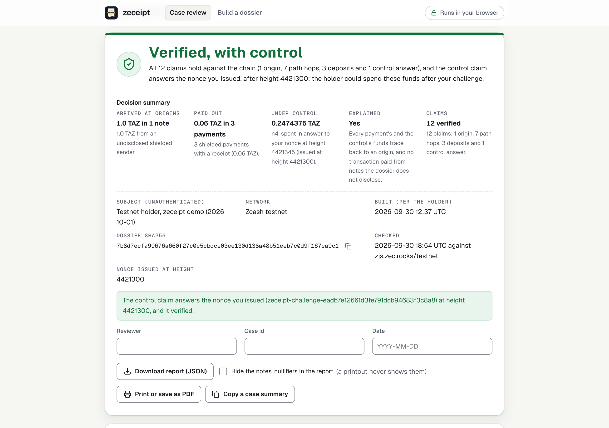
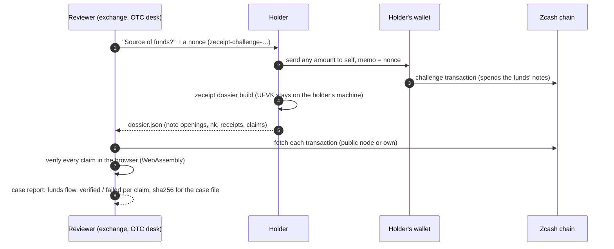
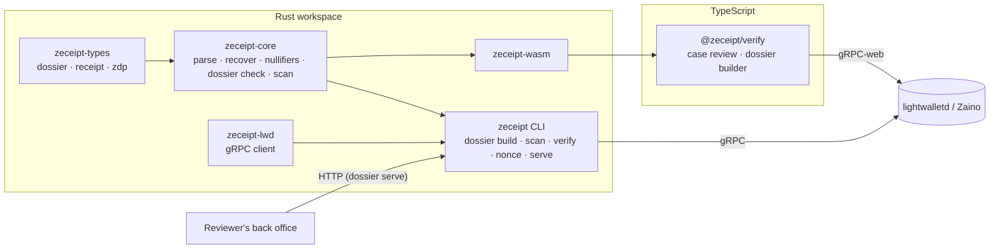

<p align="center">
  
</p>

<h1 align="center">zeceipt</h1>

<p align="center">
  <strong>Source-of-funds evidence for shielded Zcash.</strong><br>
  Prove where your shielded ZEC came from, what you paid, and that you control it now, to an exchange, an OTC desk or a lender, without handing over your viewing key.
</p>

<p align="center">
  <a href="https://beautifulremi.dpdns.org/zeceipt/case/">Review a dossier</a> &middot;
  <a href="https://beautifulremi.dpdns.org/zeceipt/build/">Build a dossier</a> &middot;
  <a href="#how-it-works">How it works</a> &middot;
  <a href="#for-judges">For judges</a> &middot;
  <a href="spec/dossier-v1.md">Spec</a> &middot;
  <a href="docs/api/dossier-service.md">API</a> &middot;
  <a href="docs/PROOF.md">Proof</a>
</p>

<p align="center">
  <a href="https://github.com/beautifulrem/zeceipt/actions/workflows/ci.yml"></a>
  <a href="LICENSE"></a>
  
  
  
  
  
</p>

---

> [!NOTE]
> Built for **Colosseum's Crypto World's Fair 2026** (Zcash track) by one developer, [@beautifulrem](https://github.com/beautifulrem). The repository started on 2026-09-21 PT, during the event. See [For judges](#for-judges) for the live sample and where each claim's evidence is.

<p align="center">
  <strong>Try it live:</strong> <a href="https://beautifulremi.dpdns.org/zeceipt/case/#sample-exchange">a real exchange-deposit review on testnet, checked claim by claim in your browser</a> &middot; <a href="https://beautifulremi.dpdns.org/zeceipt/build/">build one from your own viewing key (it never leaves the page)</a>
</p>

<p align="center">
  <picture>
    <source media="(prefers-color-scheme: dark)" srcset="docs/assets/case-review-dark.png">
    
  </picture><br>
  <sub>The case review page on the real testnet sample: every claim checked in the browser (WebAssembly) against a public node. Shot by <code>packages/verify/test/shots/case-review.mjs</code>.</sub>
</p>

## The problem

Shielded ZEC is private by design, and that is exactly what compliance desks cannot work with. When a holder deposits at an exchange, cashes out through a bridge, or sells to an OTC desk, the reviewer asks where the funds came from:
- **Kraken** asked holders to confirm "the specific source of each recent Zcash deposit", its "economic purpose", and that every external wallet is "solely owned and controlled by you" ([Zcash forum, 2026-04-14](https://forum.zcashcommunity.com/t/55347)). Zooko noted that such an email "could potentially be from the criminals intending to rob you, rather than from Kraken" ([/t/55347/2](https://forum.zcashcommunity.com/t/55347/2)); the holder's lawyer, on an earlier request of the same kind: "yeah everybody is getting those" ([/t/55347/7](https://forum.zcashcommunity.com/t/55347/7)).
- **Binance** refused deposits from shielded addresses because it could not "determine the origin of these funds", returned them after 32 working days, and now takes deposits only at TEX addresses, which accept transparent funds only ([forum, 2024-05](https://forum.zcashcommunity.com/t/47667/8); [ZIP 320](https://zips.z.cash/zip-0320)).
- **NEAR Intents** has held one holder's $589k for more than 67 days. He answers with screenshots and hashes, because there is nothing better to send ([forum, 2026-09](https://forum.zcashcommunity.com/t/57497)).

Today there are two answers, and both give up the privacy the holder chose Zcash for. One is to **deshield** before depositing, which makes everything after it public. The other is to **hand over the viewing key**, which opens every past and future payment of the wallet. Proving control of a shielded address is on the community's wishlist ([ZecDev](https://zecdev.github.io/community)), and Ironwood has no signing standard for it.

## What zeceipt does

The holder builds a **dossier**: claims about specific funds, each checkable against the chain. The reviewer opens it in a browser, and every claim is verified there against public nodes, or against the reviewer's own. There is no account, and nothing is uploaded. The dossier is the only thing shared, and each claim discloses only what it needs.

| Claim | What the reviewer learns | Checked by |
|---|---|---|
| **Origin** | These funds reached the holder in this transaction, and how it was funded: the transparent addresses whose outputs it spent (an exchange's hot wallet, say), or a shielded sender | Opening the note ([`zdp:1:`](spec/receipt-v0.md#11-delivery-proofs-zdp1-accepted-alongside-receipts)) and reading the transaction's inputs |
| **Path** | The funds moved on: this note was spent in the transaction that created that one | The note's nullifier, derived from the holder's nullifier key, found among the transaction's spends |
| **Deposit** | The holder made this payment (recipient, amount, memo) from these notes | A sender receipt (the output's OCK) plus the spent notes' nullifiers |
| **Transparent payment** | The holder paid this transparent address (an exchange's deposit address, a TEX address) this amount, from these notes: the usual cash-out | The address and amount read from the output's script, plus the spent notes' nullifiers |
| **Control** | The holder can **spend** these funds now, after the reviewer's challenge | A transaction that spends the disclosed notes and pays the holder a note whose memo carries the reviewer's nonce. A viewing key cannot make it |

Each claim reports `verified`, `failed`, `not_checked` (a transaction is not mined or not found yet: check again) or `unproven` (the data given cannot show it, for example an origin note that nothing in the dossier spends, so it is not shown to be the holder's).

A dossier discloses note openings (transaction, amount, address, memo) and the **nullifier key `nk`**, which derives nullifiers and nothing else. It does not disclose the viewing key: the reviewer cannot decrypt any other payment, past or future. What it does not prove is listed in every report: who the counterparties are, the value of undisclosed inputs, balances beyond the notes shown, and it is not a legal attestation ([`spec/dossier-v1.md`](spec/dossier-v1.md)).

## How it works



**A real one:** the [testnet sample](https://beautifulremi.dpdns.org/zeceipt/case/#sample) explains 1 TAZ from a faucet ([`fixtures/dossier/testnet-dossier.json`](fixtures/dossier/testnet-dossier.json)):
- the origin;
- four hops;
- three payments (0.01, 0.02 and 0.03 TAZ);
- a control challenge answered on chain at height 4,421,345.

All 12 claims verify live and offline ([`docs/PROOF.md`](docs/PROOF.md) §8), and the forgeries we tried fail at the claim they attack: a wrong `nk`, a wrong nonce, a foreign note, a deposit not funded by the listed notes ([`crates/zeceipt-core/tests/dossier.rs`](crates/zeceipt-core/tests/dossier.rs)).

## Quick start

You need Rust (`protoc` is optional), Node 24+ and Python 3.

**As a reviewer.** Check the sample dossier offline, from the committed transactions, then live from a public node:

```bash
cargo build --release && Z=target/release/zeceipt
$Z dossier verify fixtures/dossier/testnet-dossier.json --raw-tx-dir fixtures/testnet   # exit 0: all 12 claims verified
$Z dossier verify fixtures/dossier/testnet-dossier.json                                  # the same, fetched from testnet.zec.rocks
$Z dossier nonce                                                                          # a challenge to send a holder
$Z dossier serve --listen 127.0.0.1:8787                                                  # the same checks over HTTP, for a back office
# POST /v1/dossiers/verify?expect_nonce=…  (the dossier as the body) → the report · POST /v1/nonces · GET /healthz
```

The HTTP service is documented in [`docs/api/dossier-service.md`](docs/api/dossier-service.md), with an [OpenAPI 3.1 file](docs/api/dossier-service.openapi.json) and a [`Dockerfile`](Dockerfile) for running it behind your own TLS and authentication.

**As a holder.** Find your transactions and build a dossier. The UFVK is read from a file and never leaves your machine:

```bash
$Z dossier scan  --ufvk-file my.ufvk --from <birthday height>                     # every transaction that paid or spent your notes
$Z dossier build --ufvk-file my.ufvk --scan-from <height> \
                 --control-txid <your challenge tx> --nonce <the reviewer's nonce> > dossier.json
```

In the browser, the same checks run in WebAssembly: [`https://beautifulremi.dpdns.org/zeceipt/case/`](https://beautifulremi.dpdns.org/zeceipt/case/) for reviewers, [`https://beautifulremi.dpdns.org/zeceipt/build/`](https://beautifulremi.dpdns.org/zeceipt/build/) for holders ("Find my transactions" scans compact blocks in the page, with the UFVK kept there), or locally with `(cd packages/verify && npm run demo)`. From JavaScript: `checkDossier(text)` and `buildDossier({ ufvk, txids, control })` in [`@zeceipt/verify`](packages/verify).

## Who pays

- **Holders: free.** The builder is open source and runs locally; the wedge is the frozen or held deposit, when a holder needs an answer the reviewer can check.
- **Reviewers: paid, above a free tier.** Checking in the web page is free. The paid tiers are the verification API (per verification, or per seat for a review team) and a self-hosted service with support, priced against the analyst time a manual source-of-funds review costs; the numbers and their reasoning are in [`docs/product/08_gtm_pricing.md`](docs/product/08_gtm_pricing.md). Binance called EDD "burdensome and costly", and a dossier replaces screenshots with evidence that checks itself. No reviewer has paid or signed a letter of intent yet.
- **Why now:** the EU's AMLR applies from 2027-07-10, and its Article 79 takes anonymity-enhancing coins out of regulated venues. Zcash's case to stay reachable is selective disclosure, and the EDD workflow is where it has to work.

Dossiers are built from receipts, `zdp:1:` note openings and a payout console that also stand alone: [`docs/building-blocks.md`](docs/building-blocks.md).

## Architecture



## Integrations

- **Exchanges, OTC desks, bridges.** Ask for a dossier instead of a viewing key or a deshield: send a nonce, receive `dossier.json`, and check it in the case page, with `zeceipt dossier verify`, or through `zeceipt dossier serve`, a self-hosted HTTP service for a compliance back office (loopback by default; `--raw-tx-dir` for an air-gapped one; [API](docs/api/dossier-service.md)). The report JSON, with the dossier's sha256, goes into the case file.
- **A reviewer with their own node.** `scripts/build_site.sh OUT --node test=https://your-node/testnet --node main=https://your-node/mainnet` builds a copy of the case and build pages that fetch only from your gRPC-web nodes (lightwalletd or Zaino behind a gRPC-web proxy): their Content-Security-Policy allows only those origins, so no public node learns which transactions a case looks up. Serve the folder from any static host. In JavaScript, `useNodes({ test: [...] })` does the same for `checkDossier`. Or load the transactions as files in the case page, with no node at all.
- **Wallets (Zodl, Zingo, …).** An "Export source-of-funds dossier" button: the wallet already has the UFVK and the transaction list, and `buildDossier` in `@zeceipt/verify` (or `zeceipt_core::dossier::build`) does the rest locally. The control challenge is a send to self with the reviewer's nonce as the memo.

## For judges

**Two minutes, no install.** Open the [exchange-deposit review](https://beautifulremi.dpdns.org/zeceipt/case/#sample-exchange) (PROOF §9): an exchange's transparent hot wallet withdrew 0.2 TAZ to a customer's shielded address, the customer deposited 0.05 TAZ back to a transparent deposit address, and answered the exchange's nonce. The page fetches the four transactions from a public testnet node and checks every claim in your browser. It first shows amber, "Claims verified — control not shown", because you have not entered a nonce; press "Try it with the nonce the sample answered" (the exchange's nonce and the height it issued it at) and it turns green, "Verified, with control". Then tamper with it: change one character of `nk` or of the nonce, or enter a later issue height, and check again: the claims that rest on it fail and the rest still verify. The [faucet sample](https://beautifulremi.dpdns.org/zeceipt/case/#sample) (12 claims, PROOF §8) and [a round trip through a transparent address](https://beautifulremi.dpdns.org/zeceipt/case/#sample-transparent) are linked from the page.

**About ten minutes on a recent laptop.** The first run downloads crates and npm packages. After that, only the live `dossier verify` needs the network, and no wallet keys are involved.

```bash
cargo test --workspace --features zeceipt-core/synthetic   # 93 tests, including the official Orchard note-encryption vectors and the dossier forgeries
cargo build --release && Z=target/release/zeceipt
$Z dossier verify fixtures/dossier/testnet-dossier.json \
   --expect-nonce zeceipt-challenge-eadb7e12661d3fe791dcb94683f3c8a8   # exit 0: 12 of 12 verified, nk_proven and controlled true, from testnet.zec.rocks
$Z dossier verify fixtures/dossier/testnet-dossier.json --raw-tx-dir fixtures/testnet \
   --expect-nonce zeceipt-challenge-00000000000000000000000000000000   # exit 1, offline: the control claim fails, "not the one you issued"
node packages/verify/test/dossier-view.mjs                 # the case and build pages' logic on the real testnet dossier
(cd apps/console && npm ci && npm test)                    # 495 console tests: 465 run by default, 30 opt-in (build-and-serve, regtest); the payout console, a building block
```

**What is real and what is simulated.** The receipts and console evidence is in [`docs/building-blocks.md`](docs/building-blocks.md).

| Evidence | Chain | What it shows |
|---|---|---|
| A source-of-funds dossier: a faucet origin, four hops, three payments and a control challenge ([`fixtures/dossier/testnet-dossier.json`](fixtures/dossier/testnet-dossier.json)) | **Testnet**, heights 4,419,987–4,421,345 | All 12 claims verified live and offline, the holder's scan finding exactly its five transactions, forgeries refused ([`docs/PROOF.md`](docs/PROOF.md) §8) |
| A second dossier with a cash-out to a transparent address and back ([`fixtures/dossier/testnet-dossier-transparent-origin.json`](fixtures/dossier/testnet-dossier-transparent-origin.json)) | **Testnet**, heights up to 4,421,684 | A transparent payment of 0.05 TAZ from a disclosed note, verified from the output's script; the shielding transaction's origin names that payment as its funder; that origin is `unproven` because nothing spends its note yet, and the report says so (PROOF §8). The transparent address is the holder's own, not an exchange's |
| The case and build pages | **Testnet**, through public gRPC-web nodes | The sample verifies in the browser; the builder reproduces it from the published testnet UFVK and finds the transactions by scanning compact blocks in the page; no request carries the dossier or the key (the Chrome tests in CI) |
| `zeceipt dossier serve` | The sample, over loopback HTTP | The report the CLI prints, over `POST /v1/dossiers/verify` (`dossier_serve_answers_over_http`; [`docs/api/dossier-service.md`](docs/api/dossier-service.md)) |
| A mainnet dossier | **None yet** | Waits on mainnet funds (the owner's) |
| The nonce's freshness | Asserted | The author played both reviewer and holder, so the sample's nonce was not issued by a third party (PROOF §8) |

| Where to look | What it shows |
|---|---|
| [`docs/PROOF.md`](docs/PROOF.md) | §8: the dossier on testnet, live, offline, in JavaScript, and the forgeries. The earlier sections are the building blocks' runs |
| [`spec/dossier-v1.md`](spec/dossier-v1.md) | The dossier format, the nullifier argument, each claim's check, and why there is no "unspent at height H" claim |
| [`docs/api/dossier-service.md`](docs/api/dossier-service.md) | The HTTP service for a back office, with its OpenAPI file |
| [`docs/THREAT_MODEL.md`](docs/THREAT_MODEL.md), [`docs/SECURITY_REVIEW.md`](docs/SECURITY_REVIEW.md) | What is defended and what is not |
| [`docs/PRIOR_ART.md`](docs/PRIOR_ART.md) | Other disclosure and source-of-funds work (viewing keys, ZIP 311, Railgun PPOI, Privacy Pools, Monero), and how this differs |
| [`docs/product/`](docs/product) | Requirements, the plan, the pivot ([`13_pivot.md`](docs/product/13_pivot.md)), pricing ([`08_gtm_pricing.md`](docs/product/08_gtm_pricing.md)), and the research log behind each decision |

**Built during the hackathon.** The repository started on 2026-09-21 PT. The first commit, `683ea02`, is timestamped +08:00, so `git log` shows it as 2026-09-22 00:07. No product code predates the event. Third-party material is published crates and npm packages (pinned by the lockfiles), test vectors from `zcash-test-vectors`, one sample CSV from zecpay, and the Geist fonts and Lucide icons, each attributed in [`NOTICE`](NOTICE) (see also [`docs/PRE_EVENT_STATE.md`](docs/PRE_EVENT_STATE.md)).

**How it was built.** One developer directed the work with AI coding assistants, which wrote code, reviewed it and ran searches; every change went through the tests and checks in this repository, and all cryptography is the upstream Zcash crates'. Before the repository went public on 2026-09-29, its history was rewritten three times. The rewrites gave every commit the maintainer's GitHub noreply identity, removed the local workflow-tool directories (task notes, editor and agent settings) and a local username and paths from old files, and reworded three commit messages that named those tools. Commit dates, authorship dates and code were not changed ([`docs/SECURITY_REVIEW.md`](docs/SECURITY_REVIEW.md), publication check).

**Team.** Designed and built by one developer, [@beautifulrem](https://github.com/beautifulrem).

## Status

| | |
|---|---|
| ✅ Done | Dossiers: origin, path, deposit, transparent payment and control claims, with `unproven` kept apart from `not_checked`; the builder with a compact-block scan, in the CLI and in the page; the checks in Rust and WebAssembly; the case review and build pages; `zeceipt dossier serve` for a back office; two real testnet dossiers (PROOF §8). The building blocks (receipts, `zdp:1:` proofs, the console): [`docs/building-blocks.md`](docs/building-blocks.md) |
| 🟡 In progress | A testnet dossier shaped like an exchange withdrawal and deposit, from an address that is not the holder's, before NU7 reaches testnet on 10-06. Publishing `@zeceipt/verify` to npm |
| ⏳ Next | **NU7** (plan below). **A mainnet dossier**, once the owner funds it. **Sapling**: Sapling notes are not dossier subjects, because a Sapling nullifier needs the note's position in the commitment tree as well as `nk`; a holder moves Sapling funds to Ironwood first, and a path claim from that transaction links the new notes to the rest. **ZIP 311**: a dossier's deposit claims are ZIP 311's outputs half, and its control claim stands in for the spend-authority half; an implementation report for zcash/zips#387 is drafted, following ZCG's advice to bring ZIP 311 to Ironwood |
| ✖ Out of scope for v1 | An "unspent at height H" claim (spec §4); the counterparties' identities; a legal attestation |

**NU7.** NU7 activates on testnet on 2026-10-06 and on mainnet on 2026-11-05. The released Zcash crates do not know its consensus branch, so from those dates zeceipt refuses a transaction made after activation, by name ("NU7, ZIP 259"), until a `zcash_protocol` release carries NU7. A dossier whose transactions were all mined before activation keeps verifying after it, because the branch is read from each transaction's own header. Judging runs to 2026-12-05, so the plan is:
- the testnet samples above were mined before 10-06, and keep verifying;
- the upgrade is spiked on librustzcash main ([`docs/RELEASING.md`](docs/RELEASING.md) §1): when a release with NU7 lands, the crates are bumped, the WASM is rebuilt and a 0.2.x is released, with a target before 11-05;
- until then, the builder cannot build over a post-NU7 transaction, and a verifier fails each claim that rests on one, with the error naming NU7: a reviewer sees why, not a malformed-bytes error.

<details>
<summary><strong>Building the WASM package (reproducible)</strong></summary>

`packages/verify/pkg` is committed, so a clone works without a toolchain. To rebuild it, run `scripts/build_wasm.sh` (or `npm run build:wasm` in `packages/verify`). The `secp256k1` C library needs a wasm-capable clang: Homebrew LLVM's by default, or set `ZECEIPT_WASM_CLANG` and `ZECEIPT_WASM_AR`.

On the same toolchain the build is byte-for-byte reproducible:
- **Toolchain:** rustc 1.96.0, wasm-pack 0.15.0 (wasm-opt 117), wasm-bindgen 0.2.128 and Homebrew clang 23.1.1.
- **No local paths:** absolute build paths are remapped, with `--remap-path-prefix` for Rust and `-ffile-prefix-map` for C.
- **Committed hash:** the committed `.wasm` has sha256 `e7108d8322e445c5a3f7cccba9add72b50abb44808872a0384e34b987e7c4530`.
- **Checking it:** `scripts/build_wasm.sh --check --require-identical-wasm` rebuilds the package into a temporary directory and compares it with the committed one.
- **CI:** CI rebuilds on Linux with clang 18. The wasm-bindgen outputs must match there, and CI reports whether the `.wasm` bytes match.

</details>

## Documentation

[`spec/dossier-v1.md`](spec/dossier-v1.md) · [`docs/api/dossier-service.md`](docs/api/dossier-service.md) · [`docs/PROOF.md`](docs/PROOF.md) · [`docs/THREAT_MODEL.md`](docs/THREAT_MODEL.md) · [`docs/SECURITY_REVIEW.md`](docs/SECURITY_REVIEW.md) · [`docs/PRIOR_ART.md`](docs/PRIOR_ART.md) · [`docs/building-blocks.md`](docs/building-blocks.md) · [`spec/receipt-v0.md`](spec/receipt-v0.md) · [`docs/REGTEST_RUNBOOK.md`](docs/REGTEST_RUNBOOK.md) · [`docs/RELEASING.md`](docs/RELEASING.md) · [`CHANGELOG.md`](CHANGELOG.md)

## License

[Apache License 2.0](LICENSE). See [`NOTICE`](NOTICE) for third-party material.

Zeceipt is independent software for use with Zcash. It is not affiliated with, or endorsed by, the Zcash Foundation, Electric Coin Co. or Colosseum.

<p align="center"><sub>Built by <a href="https://github.com/beautifulrem">beautifulremi</a> for Colosseum's Crypto World's Fair 2026.</sub></p>
