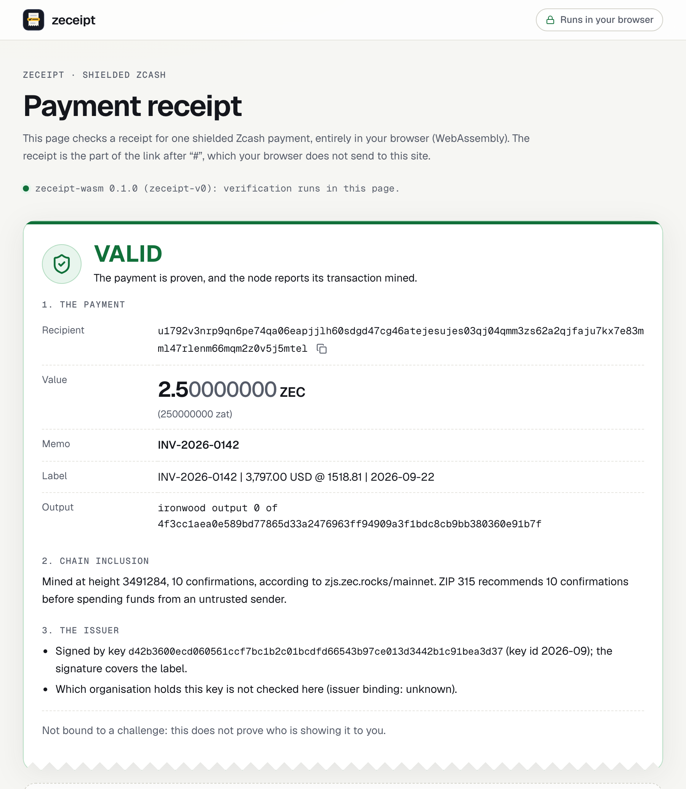
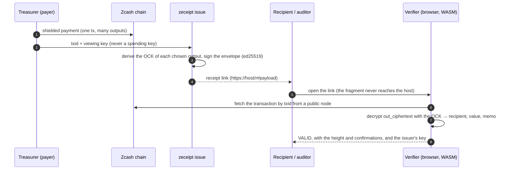
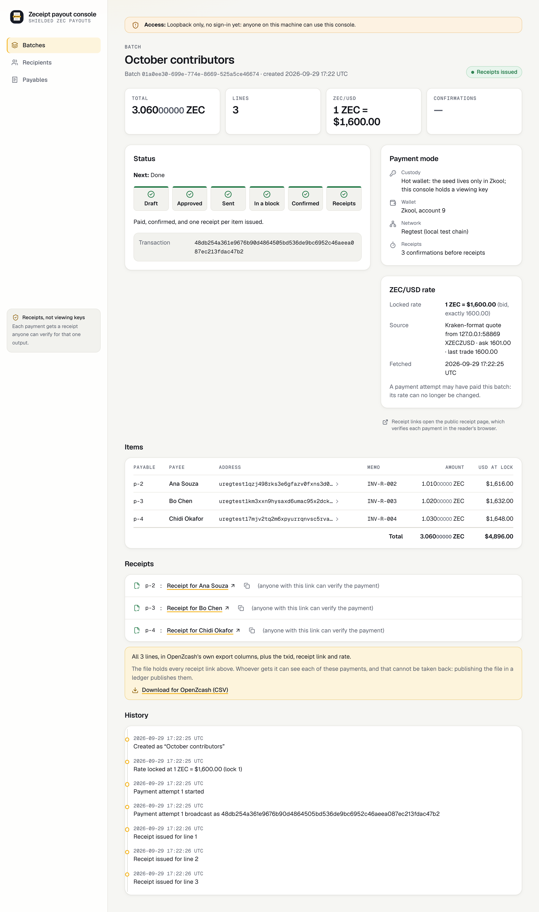
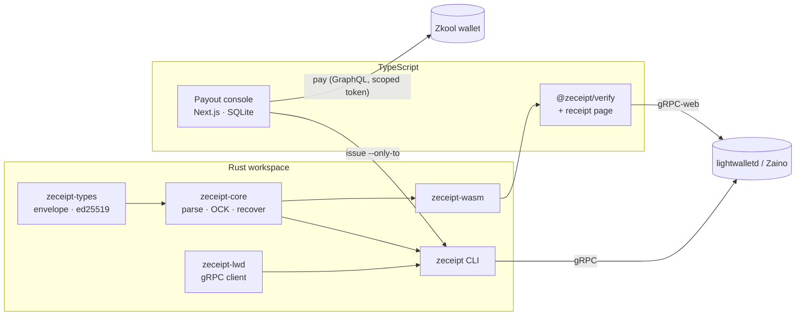

<p align="center">
  
</p>

<h1 align="center">zeceipt</h1>

<p align="center">
  <strong>Verifiable receipts for shielded Zcash payments.</strong><br>
  Show one payment (its recipient, amount and memo) to anyone. You don't hand over a viewing key, and no other payment is revealed.
</p>

<p align="center">
  <a href="#quick-start">Quick start</a> &middot;
  <a href="#how-it-works">How it works</a> &middot;
  <a href="#for-judges">For judges</a> &middot;
  <a href="spec/receipt-v0.md">Spec</a> &middot;
  <a href="docs/PROOF.md">Proof</a> &middot;
  <a href="docs/THREAT_MODEL.md">Threat model</a>
</p>

<p align="center">
  <a href="https://github.com/beautifulrem/zeceipt/actions/workflows/ci.yml"></a>
  <a href="LICENSE"></a>
  
  
  
  
  
</p>

---

> [!NOTE]
> Built for **Colosseum's Crypto World's Fair 2026** (Zcash track) by one developer, [@beautifulrem](https://github.com/beautifulrem). The repository started on 2026-09-21 PT, during the event. See [For judges](#for-judges) for a ten-minute run and where each claim's evidence is.

<p align="center">
  <picture>
    <source media="(prefers-color-scheme: dark)" srcset="docs/assets/receipt-page-dark.png">
    
  </picture><br>
  <sub>The receipt page verifying a receipt in the browser (WebAssembly). The transaction is the committed synthetic fixture, which is on no chain: the network, height and confirmations shown are simulated, as in the page's test suite (<code>packages/verify/test/shots/receipt-page.mjs</code>).</sub>
</p>

## Why

Shielded Zcash hides who paid whom and how much. That is the point, until someone needs proof:
- a contractor needs proof they were paid;
- an auditor needs this quarter's payouts;
- a DAO's public ledger needs to show a grant went out.

Today the answer is to share a **viewing key**, which exposes *every* payment the wallet has made or will make. Zeceipt gives a receipt for **one output**, which anyone can check against the chain. Nothing else is disclosed.

## How it works

Every shielded output on the chain carries an `out_ciphertext`. It is encrypted under a per-output **Outgoing Cipher Key (OCK)**, which is derived from the sender's outgoing viewing key. Disclosing that one key lets a verifier decrypt that one output and nothing else. This is the `outputs` half of [ZIP 311](https://zips.z.cash/zip-0311), implemented here for the v6 **Ironwood** pool, and for Orchard and Sapling.



A receipt is a small signed JSON envelope, `zeceipt-v0` ([`spec/receipt-v0.md`](spec/receipt-v0.md), with committed test vectors). Verification returns one of three answers: `valid`, `invalid` or `pending`. The CLI exits with 0, 1 or 2 accordingly.

### What a receipt proves, and what it does not

| A valid receipt proves | It does not prove |
|---|---|
| The named transaction pays the shown value to the shown recipient, with the shown memo | Who is presenting it (bind it to a challenge for interactive proofs) |
| Whoever made it knew that output's OCK | That the output is still unspent, or that whoever presents the receipt can spend it (a receipt carries no spending ability) |
| If signed: the holder of the issuer key made this envelope and wrote its label | Anything about other outputs, transactions or balances |
| | Spend authority: it is not a full ZIP 311 disclosure (see below) |

Verification also reports the transaction's depth in confirmations, as the node it asked sees it.

> [!IMPORTANT]
> Zeceipt is **not** a full ZIP 311 payment disclosure. ZIP 311 also requires a spend-authority signature, which needs the spending key, and zeceipt never touches spending keys. The issuer is attested by an application-layer ed25519 signature instead. It follows that anyone who holds the sender's viewing key, or an earlier receipt for the same output, can also produce a receipt for that output.

## What's inside

| Component | What it is |
|---|---|
| [`crates/zeceipt-core`](crates/zeceipt-core) | Parses v4, v5 and v6 transactions. Derives the OCK, recovers individual outputs for Ironwood, Orchard and Sapling, and issues and verifies receipts |
| [`crates/zeceipt-types`](crates/zeceipt-types) | The `zeceipt-v0` envelope, canonical signing bytes, ed25519 and the URL form (no Zcash dependencies) |
| [`crates/zeceipt-lwd`](crates/zeceipt-lwd) | A lightwalletd/Zaino gRPC client (`GetTransaction`, `GetLatestBlock`, block-range scan) |
| [`crates/zeceipt-cli`](crates/zeceipt-cli) | The `zeceipt` binary: `inspect`, `find-ironwood`, `keygen`, `issue`, `verify`, `pack`, `verify-pack`, `well-known` |
| [`packages/verify`](packages/verify) | `@zeceipt/verify`: the WASM verifier for the browser and Node, the static receipt page (`r/`) and a paste-a-receipt demo |
| [`apps/console`](apps/console) | A self-hosted payout console (Next.js, SQLite, loopback only). It pays a batch in one shielded transaction and issues a receipt for each line |

All the cryptography comes from the Zcash crates (`orchard 0.15.5`, `sapling-crypto 0.7`, `zcash_note_encryption 0.4.2`, `zcash_primitives 0.30.1`, `zcash_keys 0.16.1`). Nothing is re-implemented.

## Quick start

You need Rust (`protoc` is optional), Node 24+ and Python 3. Issue and verify a receipt **offline**, from the committed synthetic fixture:

```bash
cargo build --release && Z=target/release/zeceipt && T=$(mktemp -d)
$Z keygen --out $T/issuer.key
$Z issue  --raw-tx-file fixtures/synthetic-ironwood.hex --ovk "$(cat fixtures/synthetic-ovk.hex)" \
          --label demo --key-file $T/issuer.key --out-dir $T/r
$Z verify $T/r/*.json --raw-tx-file fixtures/synthetic-ironwood.hex --require-signature   # exit 0: valid
```

With a real transaction, the transaction is fetched from zec.rocks:

```bash
$Z inspect --txid <txid>                                     # list the shielded outputs
$Z issue --ufvk uview1… --txid <txid> --label "INV-42 | 150.00 USD" --key-file issuer.key --out-dir receipts --host <your host>
$Z verify receipts/<file>.json                               # 0 valid · 1 invalid · 2 pending · 3 usage
$Z pack --title "Q3 bounties" receipts/*.json > pack.json && $Z verify-pack pack.json   # an audit pack, with a lower-bound total
```

In the browser:

```bash
(cd packages/verify && npm run demo)   # receipt page: http://localhost:8787/r/   paste demo: http://localhost:8787/demo/
```

<details>
<summary><strong>Receipt links, and binding your key to your domain</strong></summary>

- With `--host`, `zeceipt issue` prints each receipt as `https://<host>/r#<payload>`. The receipt is in the fragment, which browsers never send to the host. **Use a host you control**, because the page it serves can read the fragment. `--host` has no default.
- `zeceipt well-known --key-file issuer.key --key-id 2026-09@pay.example.org > zeceipt.json` writes the file to serve at `https://pay.example.org/.well-known/zeceipt.json`. It must be served over HTTPS, without redirects (spec §7).
- `zeceipt verify <receipt> --check-issuer` looks the claim up and reports `confirmed`, `not_listed` or `unknown` next to the verdict. It never changes `valid`. The lookup tells the domain that one of its receipts is being checked, so it runs only when you ask. It refuses private addresses and reads at most 64 KiB.
- The receipt page offers "Check with <domain>" after a valid result. It asks the domain only when you click.

</details>

## Payout console

`apps/console` is for a treasurer who pays contributors in shielded ZEC:

1. **Recipients and payables.** Record recipients with their unified addresses, and payables in US dollars. You can also import them: a zecpay CSV becomes payables, and a Konclave payroll CSV fills the batch form.
2. **A batch at a fixed rate.** The ZEC/USD rate is quoted from Kraken and fixed for the batch. Each line is floored to the zatoshi, so the payer never overpays.
3. **Approval.** An HMAC binds the approval to the exact lines, the rate and the paying account. Any change needs a new approval.
4. **Payment.** The whole batch goes out as one Ironwood transaction, through the Zkool wallet. The seed stays in the wallet and the console holds only a viewing key. Each batch is paid once, and the rate is re-checked before paying.
5. **Receipts.** One receipt is issued per payment, automatically, once it has the configured confirmations. Each is a link its recipient can verify in the browser.

<p align="center">
  <picture>
    <source media="(prefers-color-scheme: dark)" srcset="docs/assets/console-batch-dark.png">
    
  </picture><br>
  <sub>A batch with its receipts issued: one link per payee, each verifiable by anyone who holds it (light or dark, following your system). Rendered by <code>apps/console/test/shots/gallery.ts</code> from the committed regtest transaction, with the real CLI issuing the receipts and a simulated wallet reporting the chain.</sub>
</p>

Every batch, recipient and payable keeps an append-only history. The console warns before it pays an address that an earlier receipt disclosed. The whole path, from form to payment to receipt to verification, runs on a live local regtest chain (zebrad, Zaino, Zkool): [`docs/PROOF.md`](docs/PROOF.md) §5c–§5g. How to run it: [`apps/console/README.md`](apps/console/README.md).

<details>
<summary><strong>Console security</strong> (each control has a test; <a href="docs/THREAT_MODEL.md">threat model</a>)</summary>

- **Local only.** `npm start` and `npm run dev` bind to 127.0.0.1, and the console answers only loopback `Host`s. Cross-site writes are refused, pages cannot be framed, and a per-response CSP nonce lets pages run only their own scripts.
- **The wallet.** The console talks to Zkool with a token scoped to its own account. It refuses admin, foreign, read-only, expired or unsigned tokens. It also refuses a Zkool that answers requests sent without a token.
- **Payments.** Each batch is paid in one transaction. After an uncertain outcome, the console pays again only when nothing has been mined past the attempt's expiry bound. The remaining risk is recorded as RSK-21 in [`docs/product/06_risk_register.md`](docs/product/06_risk_register.md).
- **Secrets.** Receipts are sealed at rest (AES-256-GCM), and wrap keys never reach a log.
- **Not yet:** sign-in. Anything on the machine that can reach the port can read the batches.

`scripts/security_review.sh` runs `cargo audit`, `npm audit`, gitleaks and the source guards. The results are in [`docs/SECURITY_REVIEW.md`](docs/SECURITY_REVIEW.md).

</details>

## Architecture



## Integrations

- **Payout tools (Konclave, ZBooks, …).** After broadcast, call `zeceipt_core::issue` or the CLI, and attach the receipt URL to each payslip row.
- **Public ledgers (OpenZcash).** Publish a receipt link per row. The console exports a batch in the CSV format of OpenZcash's own "Export CSV", with the txid, receipt link and rate added.
- **Auditors.** Send an audit pack instead of a viewing key. `verify-pack` reports a lower-bound total, counting each output once.
- **Wallets and explorers.** Embed `@zeceipt/verify`: verification runs locally, and the package makes a request only when you call its fetch functions.

## For judges

**About ten minutes on a recent laptop.** The first run downloads crates and npm packages. After that, nothing needs the network, and no wallet keys are involved.

```bash
cargo test --workspace --features zeceipt-core/synthetic   # 65 tests, including the official Orchard note-encryption vectors
node packages/verify/test/verify.mjs                       # the committed WASM verifier against the committed vectors
(cd apps/console && npm ci && npm test)                    # 489 console tests: 459 run by default, 30 opt-in (build-and-serve, regtest)
```

| Where to look | What it shows |
|---|---|
| [`docs/PROOF.md`](docs/PROOF.md) | Each claim with its transcript: mainnet parsing (§1), offline issue, verify and tamper (§2), the browser verifier (§2b–§2e), and the console on a live regtest chain (§5–§5g) |
| [`spec/receipt-v0.md`](spec/receipt-v0.md) | The receipt format, with test vectors |
| [`docs/THREAT_MODEL.md`](docs/THREAT_MODEL.md), [`docs/SECURITY_REVIEW.md`](docs/SECURITY_REVIEW.md) | What is defended and what is not |
| [`docs/PRIOR_ART.md`](docs/PRIOR_ART.md) | Other Zcash receipt and disclosure work, and how this differs |
| [`docs/product/`](docs/product) | Requirements, the plan and what a one-person team dropped and why (`11_plan.md` §1.1), and the research log behind each decision |

**Built during the hackathon.** The repository started on 2026-09-21 PT. The first commit, `683ea02`, is timestamped +08:00, so `git log` shows it as 2026-09-22 00:07. No product code predates the event. Third-party material is published crates and npm packages (pinned by the lockfiles), test vectors from `zcash-test-vectors`, one sample CSV from zecpay, and the Geist fonts and Lucide icons, each attributed in [`NOTICE`](NOTICE) (see also [`docs/PRE_EVENT_STATE.md`](docs/PRE_EVENT_STATE.md)).

**Team.** Designed and built by one developer, [@beautifulrem](https://github.com/beautifulrem).

## Status

| | |
|---|---|
| ✅ Done | Envelope v0 with committed vectors. Ironwood, Orchard and Sapling recovery. CLI with exit codes. gRPC client checked live against zec.rocks. WASM verifier and receipt page, with confirmations and the issuer check. Payout console end to end on regtest. v6-under-wrong-branch and above-MAX_MONEY inputs refused |
| 🟡 In progress | Receipts on a public chain: the testnet run is rehearsed and waits on faucet funds ([`docs/PROOF.md`](docs/PROOF.md) §4). Publishing `@zeceipt/verify` to npm |
| ⏳ Next | NU7 support once a `zcash_protocol` release carries it ([`docs/RELEASING.md`](docs/RELEASING.md)). Sign-in for the console. A v1 aligned with ZIP 311's encoding |
| ✖ Out of scope for v0 | The spend-authority proof (full ZIP 311) |

<details>
<summary><strong>Building the WASM package (reproducible)</strong></summary>

`packages/verify/pkg` is committed, so a clone works without a toolchain. To rebuild it, run `scripts/build_wasm.sh` (or `npm run build:wasm` in `packages/verify`). The `secp256k1` C library needs a wasm-capable clang: Homebrew LLVM's by default, or set `ZECEIPT_WASM_CLANG` and `ZECEIPT_WASM_AR`.

On the same toolchain the build is byte-for-byte reproducible:
- **Toolchain:** rustc 1.96.0, wasm-pack 0.15.0 (wasm-opt 117), wasm-bindgen 0.2.128 and Homebrew clang 23.1.1.
- **No local paths:** absolute build paths are remapped, with `--remap-path-prefix` for Rust and `-ffile-prefix-map` for C.
- **Committed hash:** the committed `.wasm` has sha256 `9bf1366cc6d094c516c81228fdfe5ca6c096efc745bc1a7bb271654055a6f8c5`.
- **Checking it:** `scripts/build_wasm.sh --check --require-identical-wasm` rebuilds the package into a temporary directory and compares it with the committed one.
- **CI:** CI rebuilds on Linux with clang 18. The wasm-bindgen outputs must match there, and CI reports whether the `.wasm` bytes match.

</details>

## Documentation

[`spec/receipt-v0.md`](spec/receipt-v0.md) · [`docs/PROOF.md`](docs/PROOF.md) · [`docs/THREAT_MODEL.md`](docs/THREAT_MODEL.md) · [`docs/SECURITY_REVIEW.md`](docs/SECURITY_REVIEW.md) · [`docs/PRIOR_ART.md`](docs/PRIOR_ART.md) · [`docs/REGTEST_RUNBOOK.md`](docs/REGTEST_RUNBOOK.md) · [`docs/RELEASING.md`](docs/RELEASING.md) · [`CHANGELOG.md`](CHANGELOG.md)

## License

[Apache License 2.0](LICENSE). See [`NOTICE`](NOTICE) for third-party material.

Zeceipt is independent software for use with Zcash. It is not affiliated with, or endorsed by, the Zcash Foundation, Electric Coin Co. or Colosseum.

<p align="center"><sub>Built by <a href="https://github.com/beautifulrem">beautifulremi</a> for Colosseum's Crypto World's Fair 2026.</sub></p>
