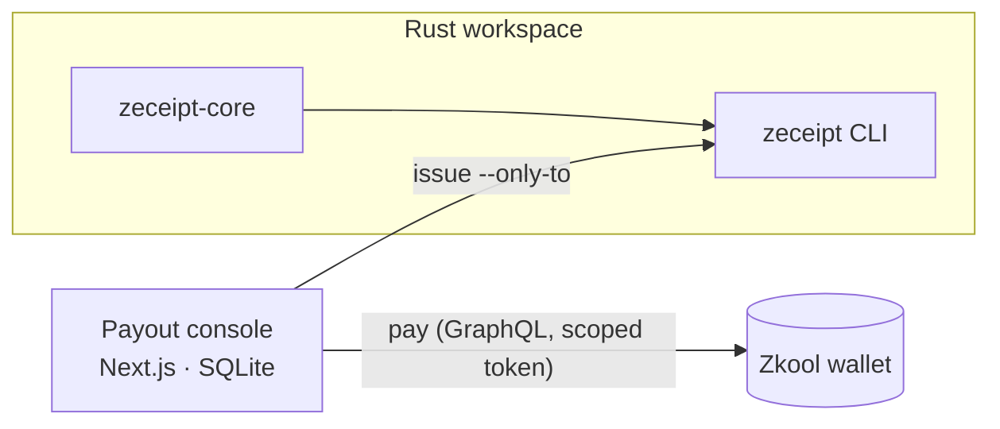

# The building blocks: receipts, delivery proofs and the payout console

Moved out of the README on 2026-09-30, when the product became source-of-funds dossiers ([`13_pivot.md`](product/13_pivot.md)). Everything here still ships and is tested; a dossier is built from the first two items: every note in a dossier is a `zdp:1:` opening, and every deposit claim carries a sender receipt ([`spec/dossier-v1.md`](../spec/dossier-v1.md) §2.2–§2.3).

- **Sender receipts** (`zeceipt-v0`, [`spec/receipt-v0.md`](../spec/receipt-v0.md)): one output disclosed by its OCK, optionally signed by an issuer key that its domain confirms.
- **Delivery proofs** (`zdp:1:`, the format of [zcash-delivery-proof](https://github.com/saplingcash/zcash-delivery-proof)): one note opened by the recipient or the sender, made with `zeceipt prove-delivery` and checked by the same verifier.
- **A payout console** (`apps/console`) for treasurers who pay in shielded ZEC and issue a receipt per payment.

Their live pages:

<p align="center">
  <strong>Try it live:</strong> <a href="https://beautifulremi.dpdns.org/zeceipt/r#eyJ2ZXJzaW9uIjoiemVjZWlwdC12MCIsIm5ldHdvcmsiOiJ0ZXN0IiwicG9vbCI6Imlyb253b29kIiwidHhpZCI6ImZjZmRlNjI1Njg1YjQzZDdhYjE3Njk3MDhmNWE2NmQ3YThmZTg4YWJiZmM2ZTE0OTk4NGYzYzBhZGE2ODdmMGIiLCJvdXRwdXRfaW5kZXgiOjIsIm9jayI6IlJQdWhlNjBCcm5IUnJSVFFlNGZkR2E1bzF6N0dhQzQ1ajA2RGVTdWhQM0EiLCJsYWJlbCI6IklOVi1ULTAwMSIsImlzc3Vlcl9rZXlfaWQiOiJ0ZXN0bmV0LTIwMjYtMDlAYmVhdXRpZnVscmVtaS5kcGRucy5vcmciLCJpc3N1ZXJfcHVia2V5IjoiY2QzNGY1NTM1YzEzOTg1ODA0MjlmODJiNGQyMzQ0ZTU1MzEzMjE0OGM4ZTY3Mzc2YjU2Nzg5MDFmODRhM2Y2ZSIsInNpZ25hdHVyZSI6ImUzMzJkN2ZhODYyMWMzODI0NmEzMzQ3ZWMwMjQ5ZTIyZjgzOWM2ZDcxMmVjYjg1MjYzYzlmOWUyYTI3MjYyYzM3NDYyOGY5YjgyMWZmZjA5ZWFjY2FiYzFjMDQyZjhmMjc3NjAwMTM1NDZhOWNhMTFjODYyZWI0OTMxZWIyYzAxIiwiemlwMzExX3Byb2ZpbGUiOiJvdXRwdXRzLW9ubHkifQ">a signed testnet receipt whose issuer your browser can confirm</a> &middot; <a href="https://beautifulremi.dpdns.org/zeceipt/r#zdp:1:C39o2go8T5hJ4ca_q4j-qNdmWo9waRer10NbaCXm_fwCAgDmVmwDIVqG3vVI37czhBnuIBkcKPKQ7Qvz6NpGILnkJpgEwGeJ8I0vrQgGQEIPAAAAAADJ4sdzUj767aI_QY3AtbzouOaN3oErCrD7_UVFnAZd1g">the recipient's own proof of that payment</a> &middot; <a href="https://beautifulremi.dpdns.org/zeceipt/r/#zdp:1:WXvYf_frFEgVwXWPSRVtapErcRDlljHTNvGK5H5d-W4CAADxmRh1VsecY8DmWr_q_tgANvb0jq3j1RgadHLEZyn5ZatN3aoO7fCrw0wdECcAAAAAAABCBHYMP_cPDLK8l-ADNQ-by718ii6Z5IwVxCO_g0Mgbg">a real mainnet payment (zcash-delivery-proof's test vector), checked in your browser</a> &middot; <a href="https://beautifulremi.dpdns.org/zeceipt/demo/">the verifier demo</a>
</p>

## Receipts: issue and verify one

Issue and verify a receipt **offline**, from the committed synthetic fixture:

```bash
cargo build --release && Z=target/release/zeceipt && T=$(mktemp -d)
$Z keygen --out $T/issuer.key
$Z issue  --raw-tx-file fixtures/synthetic-ironwood.hex --ovk "$(cat fixtures/synthetic-ovk.hex)" \
          --label demo --key-file $T/issuer.key --out-dir $T/r
$Z verify $T/r/*.json --raw-tx-file fixtures/synthetic-ironwood.hex --require-signature   # exit 0: valid
```

With a real transaction, the transaction is fetched from zec.rocks:

```bash
$Z inspect --txid <txid>                                     # list the shielded outputs
$Z issue --ufvk uview1… --txid <txid> --label "INV-42 | 150.00 USD" --key-file issuer.key --out-dir receipts --host <your host>
$Z verify receipts/<file>.json                               # 0 valid · 1 invalid · 2 pending · 3 usage
$Z pack --title "Q3 bounties" receipts/*.json > pack.json && $Z verify-pack pack.json   # an audit pack, with a lower-bound total
```

In the browser:

```bash
(cd packages/verify && npm run demo)   # receipt page: http://localhost:8787/r/   paste demo: http://localhost:8787/demo/
```

### Receipt links, and binding your key to your domain

- With `--host`, `zeceipt issue` prints each receipt as `https://<host>/r#<payload>`. The receipt is in the fragment, which browsers never send to the host. **Use a host you control**, because the page it serves can read the fragment. `--host` has no default.
- `zeceipt well-known --key-file issuer.key --key-id 2026-09@pay.example.org > zeceipt.json` writes the file to serve at `https://pay.example.org/.well-known/zeceipt.json`. It must be served over HTTPS, without redirects (spec §7).
- `zeceipt verify <receipt> --check-issuer` looks the claim up and reports `confirmed`, `not_listed` or `unknown` next to the verdict. It never changes `valid`. The lookup tells the domain that one of its receipts is being checked, so it runs only when you ask. It refuses private addresses and reads at most 64 KiB.
- The receipt page offers "Check with <domain>" after a valid result. It asks the domain only when you click.

## Payout console

`apps/console` is for a treasurer who pays contributors in shielded ZEC:

1. **Recipients and payables.** Record recipients with their unified addresses, and payables in US dollars. You can also import them: a zecpay CSV becomes payables, and a Konclave payroll CSV fills the batch form.
2. **A batch at a fixed rate.** The ZEC/USD rate is quoted from Kraken and fixed for the batch. Each line is floored to the zatoshi, so the payer never overpays.
3. **Approval.** An HMAC binds the approval to the exact lines, the rate and the paying account. Any change needs a new approval.
4. **Payment.** The whole batch goes out as one Ironwood transaction, through the Zkool wallet. The seed stays in the wallet and the console holds only a viewing key. Each batch is paid once, and the rate is re-checked before paying.
5. **Receipts.** One receipt is issued per payment, automatically, once it has the configured confirmations. Each is a link its recipient can verify in the browser.

<p align="center">
  <picture>
    <source media="(prefers-color-scheme: dark)" srcset="assets/console-batch-dark.png">
    
  </picture><br>
  <sub>A batch with its receipts issued: one link per payee, each verifiable by anyone who holds it (light or dark, following your system). Rendered by <code>apps/console/test/shots/gallery.ts</code> from the committed regtest transaction, with the real CLI issuing the receipts and a simulated wallet reporting the chain.</sub>
</p>

Every batch, recipient and payable keeps an append-only history. The console warns before it pays an address that an earlier receipt disclosed. The whole path, from form to payment to receipt to verification, runs on a live local regtest chain (zebrad, Zaino, Zkool): [`PROOF.md`](PROOF.md) §5c–§5g. How to run it: [`apps/console/README.md`](../apps/console/README.md).

**Click through the console** with no chain, wallet or network. A fake wallet stands in for Zkool, and the rate is a local $1,600. It runs on loopback and prints the pages to open; Ctrl-C deletes its database:

```bash
cargo build && cd apps/console && npm ci && npm run build && npm run try
```

The console's tests: `(cd apps/console && npm ci && npm test)`; the count is in the README's "For judges".

### Console security

Each control has a test; see the [threat model](THREAT_MODEL.md).

- **Local only.** `npm start` and `npm run dev` bind to 127.0.0.1, and the console answers only loopback `Host`s. Cross-site writes are refused, pages cannot be framed, and a per-response CSP nonce lets pages run only their own scripts.
- **The wallet.** The console talks to Zkool with a token scoped to its own account. It refuses admin, foreign, read-only, expired or unsigned tokens. It also refuses a Zkool that answers requests sent without a token.
- **Payments.** Each batch is paid in one transaction. After an uncertain outcome, the console pays again only when nothing has been mined past the attempt's expiry bound. The remaining risk is recorded as RSK-21 in [`product/06_risk_register.md`](product/06_risk_register.md).
- **Secrets.** Receipts are sealed at rest (AES-256-GCM), and wrap keys never reach a log.
- **Not yet:** sign-in. Anything on the machine that can reach the port can read the batches.

`scripts/security_review.sh` runs `cargo audit`, `npm audit`, gitleaks and the source guards. The results are in [`SECURITY_REVIEW.md`](SECURITY_REVIEW.md).

## Integrations

- **Payout tools (Konclave, ZBooks, …).** After broadcast, call `zeceipt_core::issue` or the CLI, and attach the receipt URL to each payslip row. Receipts a payer issues later serve a dossier as evidence for a deposit.
- **Public ledgers (OpenZcash).** Publish a receipt link per row. The console exports a batch in the CSV format of OpenZcash's own "Export CSV", with the txid, receipt link and rate added.
- **Auditors.** Send an audit pack instead of a viewing key. `verify-pack` reports a lower-bound total, counting each output once.
- **Wallets and explorers.** Embed `@zeceipt/verify`: verification runs locally, and the package makes a request only when you call its fetch functions.

## What is real and what is simulated (receipts and console)

The dossier rows are in the README's "For judges".

| Evidence | Chain | What it shows |
|---|---|---|
| A `zdp:1:` delivery proof of a real payment, made and proven by saplingcash (zcash-delivery-proof's own test vector, [`fixtures/zdp/mainnet.json`](../fixtures/zdp)), not by zeceipt | **Mainnet**, height 3,499,556, fetched live | Zeceipt's verifier checking a third party's real shielded Ironwood payment from a public node ([`PROOF.md`](PROOF.md) §7) |
| Zeceipt's own receipts on mainnet | **None yet** | Waits on mainnet funds; the runbook is in PROOF §4 |
| The mainnet transaction parsed and its outputs listed | **Mainnet** | Real v6 Ironwood transactions read through zec.rocks (§1) |
| Payout batches paid, receipted and verified | Local **regtest** (Zebra, Zaino, Zkool) | The console end to end, with real proofs and signatures, on a private chain (§5–§5g) |
| Zeceipt's own signed receipts for three payments ([`fixtures/testnet/`](../fixtures/testnet)) | **Testnet**, heights 4,420,000–4,420,005 | Issue, verify online and offline, an audit pack of 0.06 TAZ, a tampered copy refused, and a link verified on the live page (§6) |
| The same receipts under a key id its domain confirms ([`fixtures/testnet-bound/`](../fixtures/testnet-bound)), and the recipient's own `zdp:1:` proof | **Testnet**, the key served at `beautifulremi.dpdns.org/.well-known/zeceipt.json` | The issuer check reads "Confirmed" on the live page; the recipient proves the payment with their own key (§6) |
| The demo's "Load the sample receipt" | None: a synthetic transaction | The page's layout and checks; the page says the sample is on no chain |

## Architecture, with the console



## Status of the building blocks

| | |
|---|---|
| ✅ Done | Signed receipts on testnet for three payments (PROOF §6). Envelope v0 with committed vectors. Ironwood, Orchard and Sapling output recovery. `zdp:1:` delivery proofs checked, a real mainnet one included. The receipt page, with confirmations and the issuer check. Payout console end to end on regtest |
| 🟡 In progress | Receipts on mainnet (waits on funds, PROOF §4) |
| ⏳ Next | Sign-in for the console. A v1 receipt aligned with ZIP 311's encoding |
| ✖ Out of scope | The spend-authority signature of full ZIP 311 (a dossier's control claim covers spend authority with an on-chain challenge instead) |
